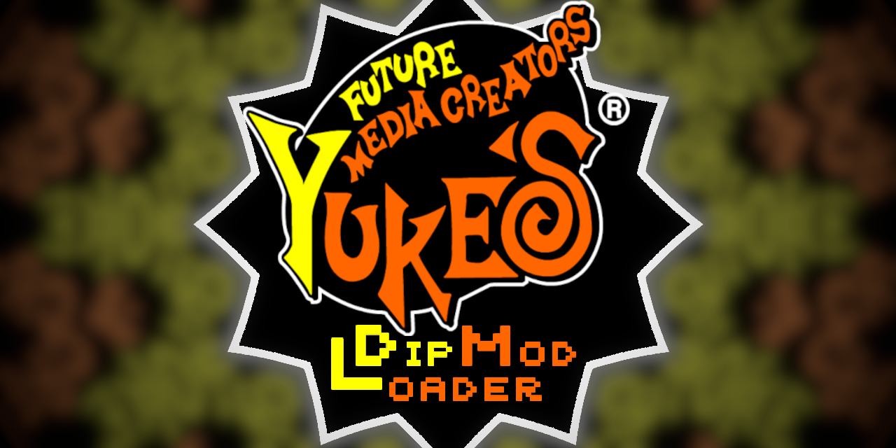

# Yukes PS2 Mod Loader

## Motive
This is a command line application designed to make creating
mods easier for most users. The standard process for
creating a mod would normally require the creator to 
manually extract the iso, extract the DIP, modify the files,
repack the DIP, and finally repackage the iso.

The lengthy process also has a tendency to make a mess of
the file system lead****ing to constant re-extraction of the
original files. These files are often very large with the
DIP averaging 500MB and the iso, 4GB.

This application handles all of the repackaging and file copying
for you. All that is required by the application is a clean copy
of the original extracted files; the modded files in the same
hierarchy as the original extracted files; a directory containing
the iso files; and a mod.info file.

This file will explain how to set up each aspect and how to 
use this application even if you've never modded anything before.

## Installation

The application simply needs to be downloaded from the releases
page on GitHub. It is designed to be run on Windows though it may
work on other operating systems.

Since the code was written in C#7, you'll need to install the
Microsoft dotNET 7.0 Runtime or higher found [here](https://dotnet.microsoft.com/en-us/download/dotnet/thank-you/runtime-7.0.14-windows-x64-installer).

## Overview

Yuke's Future Media Creators are the game development company behind
games like The Dog Island and Petz 2. These games and several others used
a archival file format to contain most of the game files, specifically for the
PlayStation2 releases, called a DIP. This application makes extracting the files from
a DIP and replacing them into a valid DIP significantly easier.

The Mod Loader is a command line application which must be run with
command line subcommands and options. 

The subcommands are as follows:
```
extract  -  Extract files from DIP or ISO.
build    -  Repack mod files into DIP and then ISO.
```
So the application is split into two main functions, extracting files from
the DIP/ISO and rebuilding the DIP/ISO. 
### Extract
The extraction command needs an input path to either a DIP file or an ISO
containing a DIP file. The output path is optional. If not given, the default path
"./" will be used which will extract the files to a folder called "root" in the directory
you call the command from.
```cmd
-i <input_path>  *  Path to DIP or ISO containing DIP.
-o <output_path>    Path to output directory for extracted files.
```
<sup><sub>(*) required argument</sub></sup>

An example extract command call looks like this:
```cmd
cd "C:\Users\admin\Downloads"
YukesModLoader.exe extract -i "The Dog Island.iso" -o "./ExtractedFiles" 
```
### Build
The build command is a little more complicated. It requires the directory
containing the extracted files, the directory containing the iso files, and
The directory containing the modded files - ([see Mod Creation](#mod-creation).)

-k is an optional argument specifying whether the DIP that is created during
the mod building process should be deleted. It is false by default meaning if not specified,
the DIP will be deleted. Only the ISO is required to run the mod.

```cmd
-e <extract_dir> *  Directory of clean extracted files.
-i <iso_dir>     *  Directory containing iso files.
-m <mod_dir>     *  Mod directory. See "Mod Creation".
-k <keep_dip?>      Keep DIP (true / false)
```
<sup><sub>(*) required argument</sub></sup>

An example build command call looks like this:
```cmd
cd "C:\Users\admin\Documents\TheDogIsland\ModdingStuff"
YukesModLoader.exe build -e "./extract/root" -i "./iso files" -m "./example mod" -k true
```
## Setup For Building
#### Creating ISO Directory
To create the iso directory, simply copy all of the files
from the original iso into a new folder somewhere on your filesystem.

You may want to move the _DATA.DIP file somewhere else
in your filesystem.

#### Extracting _DATA.DIP
_DATA.DIP is the main archive file for mid 2000s Yuke's games.
It contains most of the game files you would want to modify.
The mod loader requires a cleanly extracted copy of the DIP to
copy from to create the mods. You'll also need the clean files
so you can modify them.

Once these two folders are set up, they do not need to be set up again.
You can now proceed with the mod creation.

## Mod Creation
### Motive
Up to this point, making modifications to the DIP has
required a new copy of the 500MB filesystem of extracted files
for each mod. This is messy and uses a lot of space.
By using the mod loader, only the modified files need to be
copied.

### Mod Setup
The Mod Loader requires two parts to recognise and package
a mod. 
- The modified files in the same hierarchy as the original extracted files
- A mod.info file.

When you want to create a new mod, make a new folder.
You can name this folder whatever you'd like.

Now in this folder, make a new folder called root and
a new text file called "mod.info".

Add your modified files to the root folder you just created.
Each file must have the same relative path as the original files.

For example:

If your mod changes the file with path
```
extracted_files_root/chara/001/001_0.ymp
```
Then the modified 001_0.ymp must be at the path
```
mod_folder/root/chara/001/001_0.ymp
```
No unmodified files are required in the mod folder.

### Mod.Info

Finally, let's talk about mod.info.
This file gives information about the mod to be used
when building the iso.

The Mod Loader uses three markers to determine this information. 
```
[GAME]         The name of the game. 
[MOD]          The name of the modification.
[EXCLUSIONS]   A list of file paths for files that should be deleted.
```
#### \[GAME]
The game tag should be on a single line immediately before
the line containing the name of the game you're making the mod for.

#### \[MOD]
The mod tag should be on a single line immediately before
the line containing a title for your mod.

#### \[EXCLUSIONS]
The exclusions tag is used to define files from the original
extracted files which should NOT be copied into the DIP and iso.
This is almost never going to be the case but this has been included
as a failsafe. Each line after the exclusions tag until a line reading
```
<end>
```
or the end of the file, should contain a file path relative to the root.

For example
```
[EXCLUSIONS]
chara/001/001_0.ymp
script/1002.efi
pms/obj/004.pac
<end>
```
If the exclusions tag is empty or not present the mod loader
will not exclude any files from the original extracted files.

Once the mod.info and modded root directory have been set up,
use the mod loader to package the mod as described above.
The packaged DIP will by default be deleted but can be moved to the 
mod directory with the -k argument as
```
-k true
```
The iso, once built, will be placed in the mod directory.
It is up to you to manage the iso files and remove them if not in use.

The building process can take upwards of 2 minutes.
Please be patient, the file sizes are large and no
alternative is known to be possible yet.

## Support
Need help? Come join [my discord](https://discord.gg/Ar3wFFy7W2)!

Please raise any issues with the code on github or message me directly.

****